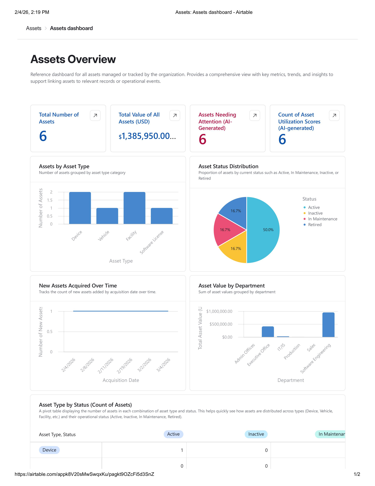
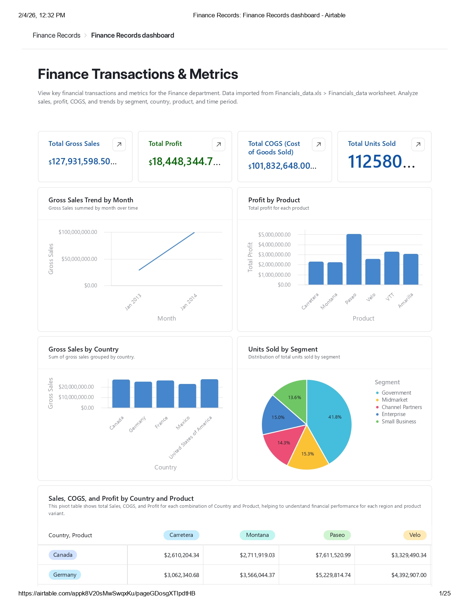
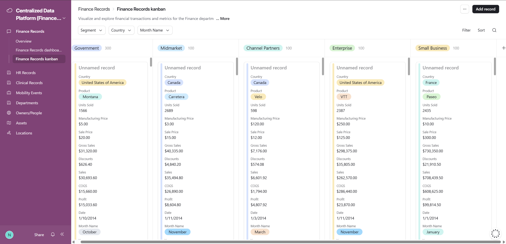
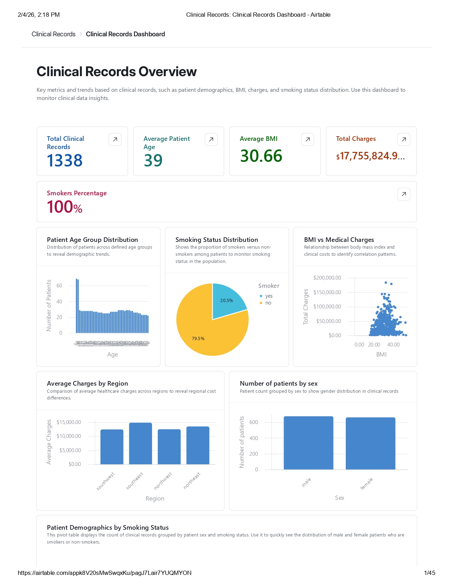
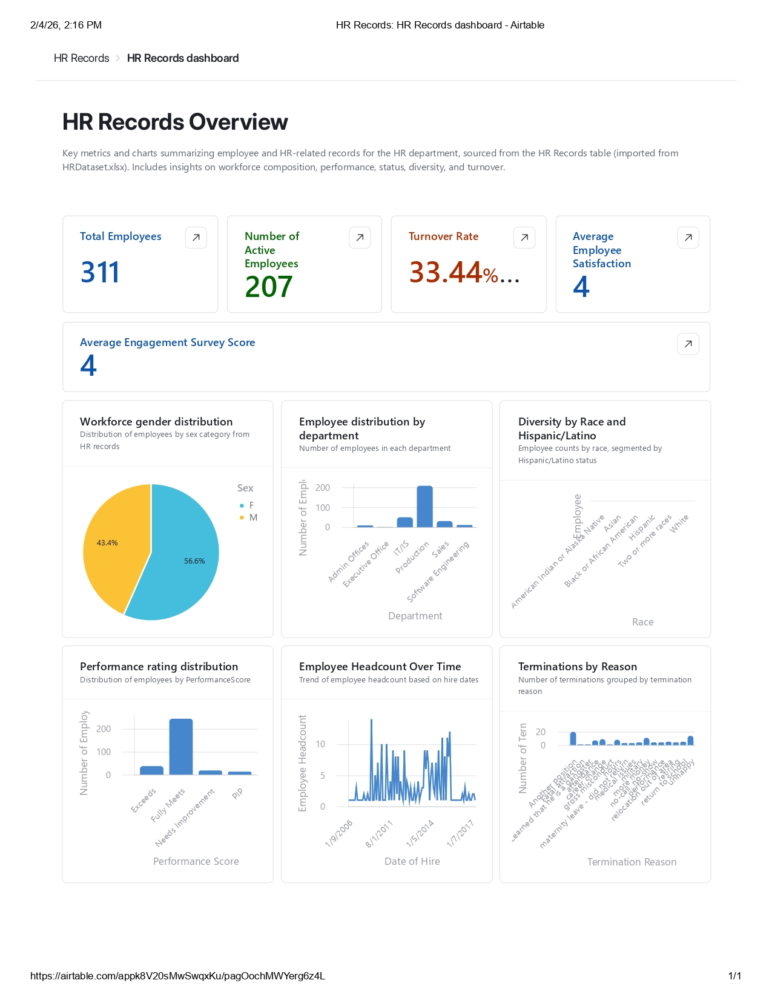
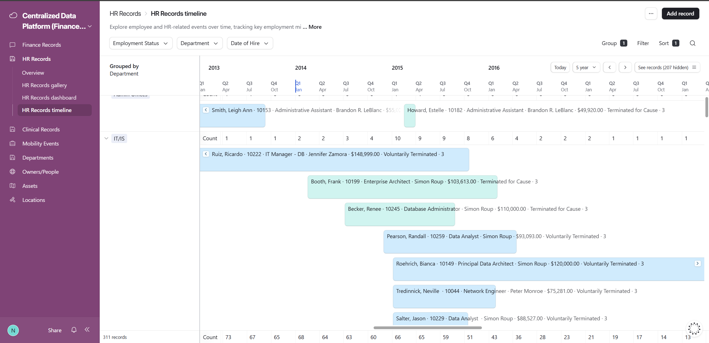
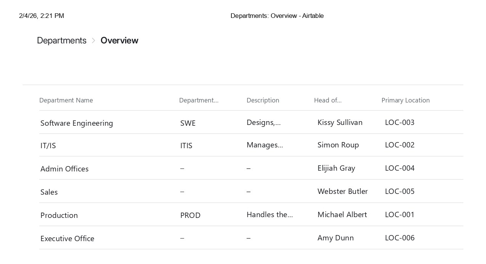

# Airtable_Demo
This project centralizes Finance, Clinical, and HR data from Google Sheets and integrates Mobility application data into Airtable to enable real-time dashboards, automations, and cross-department reporting.

---

## Data Sources
### Google Sheets
- Department-level datasets (Finance, Clinical, HR)
- One-way live sync into Airtable
- Structured with stable unique identifiers

### Mobility Application
- Operational and event-level data
- Ingested via API, webhooks, or scheduled jobs
- Upserted into Airtable using unique event IDs

---

## Airtable Data Model
### Core Tables
- Finance_Data (synced)
- Clinical_Data (synced)
- HR_Data (synced)
- Mobility_Events (ingested)
- Departments
- Owners / People (optional)
- Assets / Locations (optional)

### Design Principles
- Stable unique IDs (`Record_ID`, `Mobility_Event_ID`)
- Normalized reference tables
- Consistent status, priority, and ownership taxonomies
- Metadata for auditability (`ingested_at`, `sync_status`)

---

## Dashboards (Airtable Interfaces)
- Leadership overview with cross-department KPIs
- Department-specific dashboards (Finance, Clinical, HR)
- Filters by department, owner, date range, and priority
- Action views for overdue and high-priority items

---

## Automations
- Status-based notifications and alerts
- SLA and overdue tracking
- Threshold-based escalation rules
- Automatic record assignment and routing

**Outputs:**
- Email notifications
- Slack alerts (optional)
- Field updates

---

## Mobility Data Ingestion
- Incremental upserts based on `Mobility_Event_ID`
- Duplicate prevention
- Ingestion metadata tracking
- Supports scheduled pulls or webhook-based ingestion

---

---

## Access & Governance
- Role-based access by department
- Interface-level permissions
- Centralized definitions for status, priority, and ownership

---

## Goal
Deliver a **scalable, automation-ready operational platform** that provides real-time visibility, improves accountability, and supports data-driven decision-making.

## Dashboards

### Assets Overview

Tracks organizational assets, utilization, status distribution, and department-level value.

---

### Finance Records Dashboard

Shows financial KPIs including gross sales, profit, COGS, trends by product/country, and units sold by segment.

---

### Finance Kanban View

Kanban-style operational view for financial records segmented by business category.

---

### Clinical Records Dashboard

Key clinical metrics including demographics, BMI distribution, smoking status, and charges analysis.

---

### HR Records Dashboard

Workforce metrics including headcount, turnover, satisfaction, diversity, performance, and terminations.

---

### HR Timeline View

Timeline view of employee lifecycle events grouped by department and employment status.

---

### Departments Overview

Reference table of departments, department heads, and primary locations.

